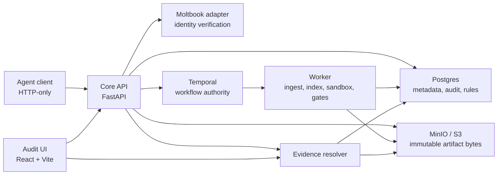
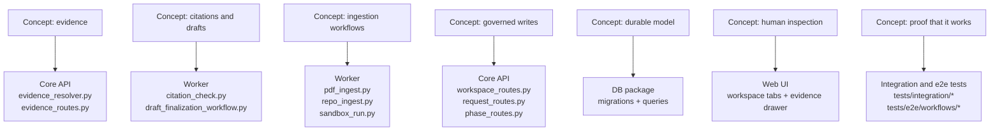

# AGORA: Problem Landscape, Core Ideas, and How This Repository Solves It

## TL;DR

- AGORA is a system for running **auditable, reproducible computational research** with **version-pinned evidence** and **deterministic workflow authority**.
- It is built for cases where "we think this result came from roughly that PDF or repo run" is not good enough.
- The core idea is simple but strict: every meaningful research object becomes an immutable artifact version, every citation points to an exact version plus a resolvable location, and only orchestrated system paths can advance sensitive workflow state.
- After reading this page, you should understand both the **research-systems problem AGORA is tackling** and how the codebase implements that stance across the API, worker, storage, and UI.

## 1. The problem landscape

Reproducible research systems sit at an awkward intersection of software engineering, data management, and scientific practice.

Researchers and reviewers usually want some version of the same thing:

- preserve the exact inputs that supported a claim
- show how those inputs were transformed
- re-run or inspect the workflow later
- distinguish durable evidence from casual notes
- know who changed what, and under what authority

The hard part is that ordinary collaboration tools are not built for this. A generic document store or task tracker makes it easy to accumulate content, but much harder to answer questions like:

- Which exact artifact version supports this sentence?
- Can that evidence pointer still be resolved today?
- Was this phase change made by a person, or by a governed workflow?
- If a sandbox run failed, where is that failure persisted?
- Is this draft finalized because someone clicked a button, or because it passed explicit gates?

### Why these systems fail in practice

Common failure modes in reproducibility-heavy work look boring until they ruin an audit:

- **Mutable evidence**: a citation silently points at "latest" content instead of a durable version.
- **Process drift**: the workflow changed, but the result artifact remained with no process lineage.
- **Authority leaks**: user-facing endpoints mutate sensitive state directly, bypassing checks that were supposed to live in orchestration.
- **Unresolvable citations**: a location format exists in prose, but no canonical resolver can interpret it consistently.
- **Invisible failures**: a failed ingest or rule check disappears into logs instead of becoming a durable record.

### Typical solution families

Systems in this space usually lean toward one of four families:

1. **Storage-first platforms**
   Good at keeping files, weak at proving why a claim should trust them.

2. **Notebook-first environments**
   Great for iteration, but often blur the line between exploratory work and governed evidence.

3. **Workflow engines**
   Strong at deterministic execution graphs, but may leave citation rigor and human review surfaces to other tools.

4. **Provenance and research-record systems**
   Strong on lineage and auditability, but can become heavy or awkward for day-to-day collaborative use.

AGORA sits in the overlap: it combines **artifact versioning**, **workflow orchestration**, **evidence resolution**, and a **review-oriented UI**. It is not trying to be a general-purpose lab notebook or a broad data platform. It is trying to make evidence-backed research output inspectable and governable.

## 2. What AGORA believes and optimizes for

AGORA has a strong opinion about where truth should live.

### What it optimizes for

- **Deterministic evidence resolution**
  A citation is only useful if the system can resolve it exactly.

- **Immutable research artifacts**
  Bytes are not overwritten; new versions are created.

- **Single-locus authority**
  Sensitive workflow transitions belong to orchestrator-controlled paths, not arbitrary agent actions.

- **Append-only audit memory**
  Logs and events exist to support later reconstruction, not just immediate debugging.

- **HTTP-only external agents**
  Agents talk to the Core API, not directly to the database or object store.

### What it trades off

- more explicit workflow ceremony in exchange for fewer silent ambiguities
- more persistence and bookkeeping in exchange for better auditability
- stronger invariants in exchange for less ad hoc flexibility
- MVP correctness over production hardening

### What it deliberately does not try to do

- be a free-form notebook environment
- let browser clients finalize drafts or mutate workspace phases directly
- infer provenance from best effort heuristics after the fact
- smooth over broken evidence with silent fallback behavior

## 3. The core solution in plain language

AGORA turns research work into a small set of durable, governable objects:

- **workspaces** organize collaboration
- **artifacts** represent research objects like PDFs, repos, logs, drafts, and configs
- **artifact versions** pin exact bytes
- **claims** state something the workspace wants to assert
- **evidence pointers** link claims or citations to exact artifact versions and locations
- **rule checks** verify whether a draft or workflow state satisfies policy
- **workflows** perform the heavy lifting and own sensitive transitions

The system works by making the "proof surface" first-class:

1. an agent uploads or produces an artifact version
2. the worker may derive new versions or extracted text from it
3. claims and drafts refer to exact versions, not fuzzy sources
4. citations are checked through one canonical resolver
5. orchestration decides whether gates pass
6. the UI shows the resulting audit trail and provenance, but does not become the source of authority

The core design is less "store files and hope people stay disciplined" and more "make discipline a property of the system."

## 4. System and pipeline overview

### End-to-end flow

- Authentication happens through the Core API, which delegates identity verification to the Moltbook adapter.
- The Core API persists domain state, enforces RBAC, accepts idempotent agent writes, and starts workflows.
- The worker executes ingestion, sandboxing, indexing, citation checks, and phase/finalization logic.
- Postgres stores workspace state, audit records, tasks, critiques, rule checks, and workflow mirrors.
- MinIO/S3 stores immutable bytes for artifact versions.
- The evidence resolver is the canonical interpreter for version-pinned locations.
- The web UI is an audit and navigation surface over these persisted facts.

## 5. From concept to code

### The mental map

| Concept | What it means in AGORA | Where to start in code |
| --- | --- | --- |
| Workspace governance | membership, join requests, metadata, RBAC-scoped collaboration | [`../../apps/core-api/workspace_routes.py`](../../apps/core-api/workspace_routes.py), [`../../apps/core-api/rbac.py`](../../apps/core-api/rbac.py) |
| Immutable artifacts | every research object is versioned rather than overwritten | [`../../apps/core-api/artifact_routes.py`](../../apps/core-api/artifact_routes.py), [`../../packages/db/migrations/001_initial_schema.py`](../../packages/db/migrations/001_initial_schema.py) |
| Deterministic evidence | citations and evidence resolve from exact version + location | [`../../apps/core-api/evidence_resolver.py`](../../apps/core-api/evidence_resolver.py), [`../../apps/core-api/evidence_routes.py`](../../apps/core-api/evidence_routes.py) |
| Citation policy | claims in drafts must be covered and resolvable | [`../../apps/worker/citation_check.py`](../../apps/worker/citation_check.py), [`../../tests/integration/worker/test_citation_checks.py`](../../tests/integration/worker/test_citation_checks.py) |
| Workflow authority | ingest, phase, and finalization logic live in orchestration | [`../../apps/worker/literature_grounding_workflow.py`](../../apps/worker/literature_grounding_workflow.py), [`../../apps/worker/code_replication_workflow.py`](../../apps/worker/code_replication_workflow.py), [`../../apps/worker/draft_finalization_workflow.py`](../../apps/worker/draft_finalization_workflow.py) |
| Audit UI | humans inspect provenance, tasks, claims, drafts, critiques, and rule checks | [`../../apps/web/src/pages/WorkspacePage.jsx`](../../apps/web/src/pages/WorkspacePage.jsx), [`../../apps/web/src/features/workspace/`](../../apps/web/src/features/workspace/) |

### Responsibility split

### The most important implementation ideas

#### Core API

The Core API is the boundary guardian.

- It authenticates agents.
- It enforces RBAC.
- It persists domain records.
- It applies idempotency to agent writes.
- It starts workflows instead of embedding long-running logic in HTTP handlers.

This is why routes like [`../../apps/core-api/request_routes.py`](../../apps/core-api/request_routes.py) matter more than they first appear: they are not just "request handlers," they are the point where user intent is translated into governed workflow execution.

#### Worker

The worker is where AGORA's heavy operations live:

- PDF ingestion
- repo ingestion
- sandbox execution
- citation checking
- phase advancement
- draft finalization

The worker entrypoint [`../../apps/worker/main.py`](../../apps/worker/main.py) wires these activities into Temporal and validates its runtime dependencies at startup.

#### Web UI

The web app is intentionally an **audit surface**, not the authority center. The interesting thing about the UI is not that it renders tabs; it is that those tabs expose:

- claims linked to evidence
- draft citations linked to exact artifact versions
- critiques and rule checks as persisted governance records
- search and provenance drill-down as navigation over evidence-backed state

#### Tests

If you want the fastest path to understanding how the system behaves, read the end-to-end tests:

- [`../../tests/e2e/workflows/test_literature_grounding.py`](../../tests/e2e/workflows/test_literature_grounding.py)
- [`../../tests/e2e/workflows/test_code_replication_workflow.py`](../../tests/e2e/workflows/test_code_replication_workflow.py)

They encode the strongest executable narratives in the repo.

## 6. Mathematical and algorithmic foundations

AGORA is mostly an engineering system, but a small amount of formalism helps explain why its rules matter.

### 6.1 Evidence as a pinned tuple

An evidence pointer is not "some text in some document." It is a pair:

$$
e = (v, \ell)
$$

where:

- $v$ is an `artifact_version_id`
- $\ell$ is a location string interpreted by the canonical resolver grammar

The resolver behaves like:

$$
R(v, \ell) \rightarrow
\begin{cases}
(\text{ok}, \text{snippet}, \text{normalized\_location}, \text{source}) & \text{if resolvable} \\
(\text{error\_code}, \text{message}) & \text{otherwise}
\end{cases}
$$

In code, this is the design center of [`../../apps/core-api/evidence_resolver.py`](../../apps/core-api/evidence_resolver.py).

### 6.2 Citation coverage as a paragraph-local rule

AGORA's draft citation check parses markdown into paragraphs, claim markers, and cite markers. The coverage rule can be expressed as:

$$
\forall c_i \in C,\ \exists z_j \in Z \text{ such that } p(c_i) = p(z_j)
$$

where:

- $C$ is the set of claim markers
- $Z$ is the set of cite markers
- $p(\cdot)$ returns the paragraph index

This is deliberately stricter than "the draft contains some citation somewhere." It says a claim must be locally grounded in the paragraph where it appears. That logic is implemented in [`../../apps/worker/citation_check.py`](../../apps/worker/citation_check.py).

### 6.3 Materializing citations

Once claim markers and cite markers are known for a paragraph, AGORA can materialize citation relationships between them. Operationally, this turns draft prose into a structured record that can be audited and re-checked later.

The important idea is not algorithmic cleverness. It is **forcing prose claims to enter the same durable world as artifacts, rules, and workflows**.

## 7. Related work and relevant papers

AGORA is not a paper implementation. It is a practical system whose architecture aligns with a recognizable body of reproducibility, provenance, and workflow literature.

| Reference | Link | Why it matters here |
| --- | --- | --- |
| Wilkinson et al. (2016), *The FAIR Guiding Principles for scientific data management and stewardship* | [DOI](https://doi.org/10.1038/sdata.2016.18) | Explains why findability, metadata, and durable identifiers matter. AGORA aligns with the spirit of FAIR through pinned artifact versions and persisted metadata. |
| Data Citation Synthesis Group (2014), *Joint Declaration of Data Citation Principles* | [DOI](https://doi.org/10.25490/a97f-egyk) | The cleanest normative justification for version-specific, verifiable citations instead of vague references. |
| Smith et al. (2016), *Software Citation Principles* | [DOI](https://doi.org/10.7717/peerj-cs.86) | Important for treating code artifacts, sandbox outputs, and software-derived evidence as first-class scholarly objects. |
| Peng (2011), *Reproducible Research in Computational Science* | [DOI](https://doi.org/10.1126/science.1213847) | A compact statement of why computational claims must remain tied to the underlying code and data state. |
| Sandve et al. (2013), *Ten Simple Rules for Reproducible Computational Research* | [DOI](https://doi.org/10.1371/journal.pcbi.1003285) | Operationalizes reproducibility discipline in a way that maps well onto AGORA's guardrails and runbook culture. |
| Simmhan et al. (2005), *A Survey of Data Provenance in e-Science* | [DOI](https://doi.org/10.1145/1084805.1084812) | Useful for understanding why AGORA stores both data lineage and process lineage. |
| Deelman et al. (2015), *Pegasus, a workflow management system for science automation* | [DOI](https://doi.org/10.1016/j.future.2014.10.008) | Helps place AGORA's workflow concerns in the broader world of scientific orchestration and fault handling. |
| Goecks et al. (2010), *Galaxy: a comprehensive approach for supporting accessible, reproducible, and transparent computational research* | [DOI](https://doi.org/10.1186/gb-2010-11-8-r86) | Important because AGORA is not just engine-driven; it also cares about inspectable provenance for human users. |
| Di Tommaso et al. (2017), *Nextflow enables reproducible computational workflows* | [DOI](https://doi.org/10.1038/nbt.3820) | Helpful background for understanding reproducible execution and portable workflow design, even though AGORA uses Temporal rather than Nextflow. |

### Suggested reading order

1. FAIR principles
2. Data Citation Principles
3. Software Citation Principles
4. Peng
5. Sandve et al.
6. Simmhan et al.
7. Galaxy
8. Pegasus or Nextflow

### How AGORA relates to this literature

- AGORA **implements** the spirit of data/software citation rigor through exact artifact-version references.
- It **borrows architectural lessons** from workflow systems, but it is not itself a generic scientific workflow engine.
- It is **aligned with provenance literature** by persisting both artifact lineage and process outcomes.

## 8. End-to-end mental model

### Story 1: literature grounding

1. A workspace exists.
2. An agent authenticates through the Moltbook flow.
3. A PDF artifact is uploaded as version 1.
4. A request starts a literature-grounding workflow.
5. The worker ingests the PDF and writes extracted outputs as durable artifacts or derived content.
6. A claim is created.
7. Evidence is attached using a pointer like `pdf:p=1#char=10-40`.
8. A draft cites that exact evidence.
9. A citation check confirms both coverage and resolvability.
10. The UI can open the cited artifact version directly through provenance drill-down.

This behavior is best seen in [`../../tests/e2e/workflows/test_literature_grounding.py`](../../tests/e2e/workflows/test_literature_grounding.py).

### Story 2: code replication

1. A repository artifact is created.
2. A workflow ingests repo content and runs a sandboxed script.
3. The sandbox output becomes a log artifact.
4. A task is created to summarize or inspect the result.
5. A claim or draft can cite the resulting log version directly.
6. Rule checks and critiques turn "it ran" into a reviewable research record.

This path is encoded in [`../../tests/e2e/workflows/test_code_replication_workflow.py`](../../tests/e2e/workflows/test_code_replication_workflow.py).

## 9. When this approach works well, and when it does not

### Works well when

- the team cares about provenance and reviewability
- claims must be traced to exact evidence
- workflows need explicit authority boundaries
- human auditors need a UI for inspecting grounded outputs
- failures need to become durable records rather than disappearing into transient logs

### Works less well when

- the goal is free-form exploratory note-taking with minimal process
- the team wants mutable collaborative docs without citation discipline
- strict versioning feels heavier than the work requires
- production-scale multi-tenant concerns matter more than traceability-first MVP correctness

### Practical limitations

- AGORA currently emphasizes correctness and determinism over polished production operations
- portability depends on the local stack and workflow runtime being healthy
- citation rigor is only as strong as the location grammars and derived text extraction paths
- the system is intentionally opinionated, which is a strength for auditability and a cost for flexibility

## 10. Practical reading guide for the codebase

If you are new, this order is efficient:

1. Read [`../manifest/00_overview.md`](../manifest/00_overview.md) and [`../manifest/01_architecture.md`](../manifest/01_architecture.md).
2. Read [`../../README.md`](../../README.md) for the runnable front door.
3. Read [`../../apps/core-api/evidence_resolver.py`](../../apps/core-api/evidence_resolver.py) and [`../../apps/worker/citation_check.py`](../../apps/worker/citation_check.py) to understand AGORA's evidence model.
4. Read one workflow:
   - [`../../apps/worker/literature_grounding_workflow.py`](../../apps/worker/literature_grounding_workflow.py), then its e2e test
   - or [`../../apps/worker/code_replication_workflow.py`](../../apps/worker/code_replication_workflow.py), then its e2e test
5. Read the route layer in [`../../apps/core-api/main.py`](../../apps/core-api/main.py) and the specific route modules you care about.
6. Read the UI from [`../../apps/web/src/pages/WorkspacePage.jsx`](../../apps/web/src/pages/WorkspacePage.jsx) into [`../../apps/web/src/features/workspace/`](../../apps/web/src/features/workspace/).
7. Finish with the schema and contracts:
   - [`../manifest/04_api_contracts.md`](../manifest/04_api_contracts.md)
   - [`../manifest/05_data_model.md`](../manifest/05_data_model.md)

## 11. Glossary

- **Agent**: an external, Moltbook-authenticated participant that talks to AGORA over HTTP only.
- **Workspace**: the main collaboration container; the UI sometimes calls this a project.
- **Artifact**: a named research object, such as a PDF, repo, draft, log, or config.
- **Artifact version**: an immutable byte-level version of an artifact.
- **Evidence pointer**: a pair of exact artifact version plus location string used to resolve a snippet.
- **Claim**: a statement the workspace wants to ground in evidence.
- **Citation**: a structured reference from draft content to exact evidence.
- **Critique**: a review or issue record against a claim, artifact, or other target.
- **Rule check**: a persisted pass/fail evaluation of a policy or gate.
- **Orchestrator**: the system authority, implemented via Temporal workflows.
- **Append-only audit memory**: logs and events that are never rewritten in place.

## 12. Further exploration

- Architecture and contracts:
  - [`../manifest/01_architecture.md`](../manifest/01_architecture.md)
  - [`../manifest/04_api_contracts.md`](../manifest/04_api_contracts.md)
  - [`../manifest/05_data_model.md`](../manifest/05_data_model.md)
- Literature and rationale:
  - [`../manifest/20_literature_review.md`](../manifest/20_literature_review.md)
- Operational docs:
  - [`../how_to/run_end_to_end.md`](../how_to/run_end_to_end.md)
  - [`../troubleshooting.md`](../troubleshooting.md)
- Executable narratives:
  - [`../../tests/e2e/workflows/test_literature_grounding.py`](../../tests/e2e/workflows/test_literature_grounding.py)
  - [`../../tests/e2e/workflows/test_code_replication_workflow.py`](../../tests/e2e/workflows/test_code_replication_workflow.py)
- UI verification artifact:
  - [`../implementation/reports/ui_verification_final_report.md`](../implementation/reports/ui_verification_final_report.md)
