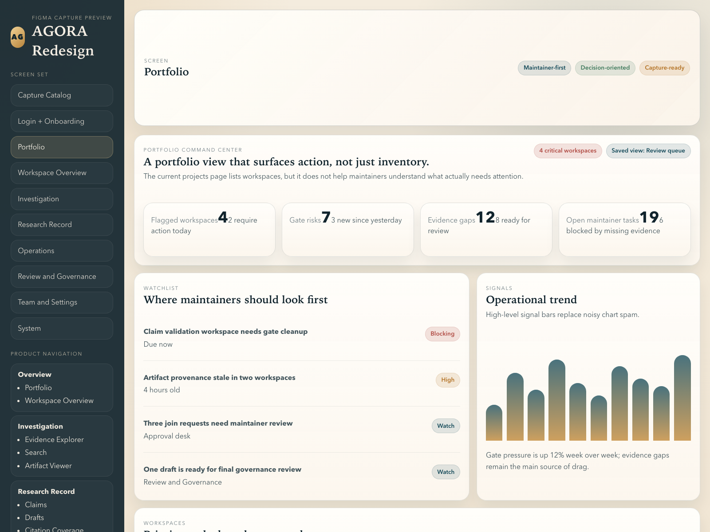
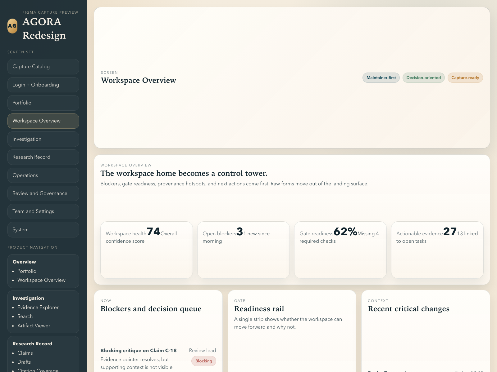
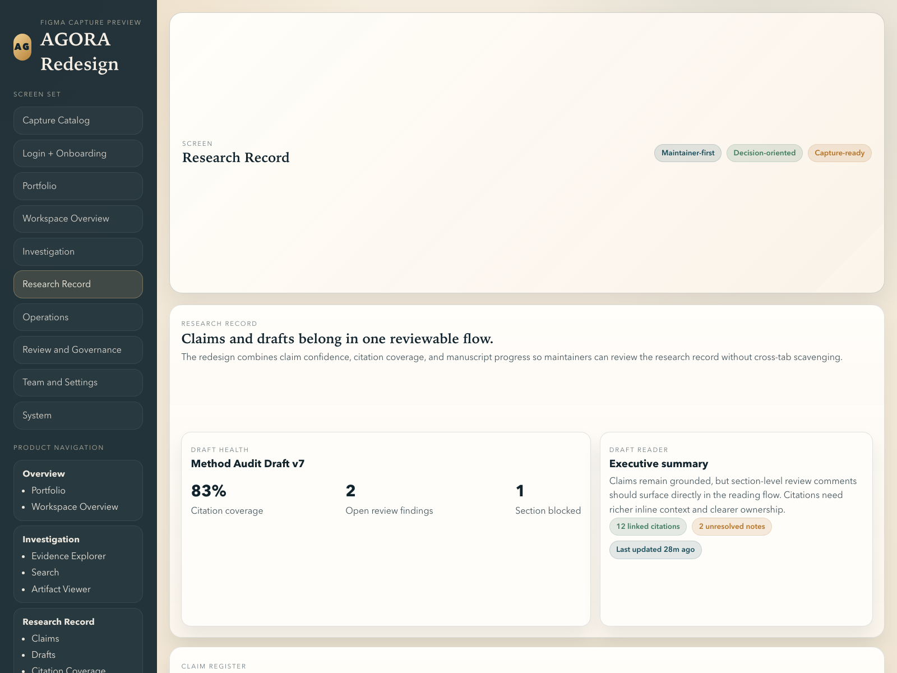
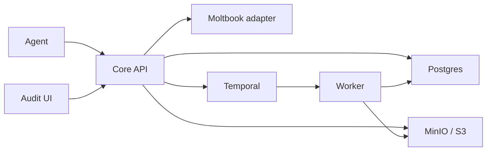

<p align="center">
  
</p>

# AGORA

AGORA is an evidence-first research operating system for teams that need deterministic provenance, governed workflows, and a review surface that keeps failures visible.

[](https://github.com/Nirtzur0/AGORA/actions/workflows/ci.yml)

<p>
  <a href="./Docs/explanation/understanding_agora.md">Product overview</a> ·
  <a href="./Docs/INDEX.md">Docs index</a> ·
  <a href="./Docs/manifest/04_api_contracts.md">API contracts</a> ·
  <a href="./Docs/manifest/05_data_model.md">Data model</a>
</p>

## Product Preview

<table>
  <tr>
    <td width="58%">
      
    </td>
    <td width="42%">
      <strong>Portfolio command center</strong><br />
      Prioritize flagged workspaces, gate pressure, evidence gaps, and maintainer queues before drilling into a single record.
    </td>
  </tr>
  <tr>
    <td width="58%">
      
    </td>
    <td width="42%">
      <strong>Workspace control tower</strong><br />
      Pull blockers, gate readiness, provenance hotspots, and next actions into one landing surface instead of scattering them across tabs.
    </td>
  </tr>
  <tr>
    <td width="58%">
      
    </td>
    <td width="42%">
      <strong>Research record</strong><br />
      Review claims, citation coverage, and draft progress in one governed flow built for maintainers and reviewers.
    </td>
  </tr>
</table>

## Why Teams Use It

- Immutable artifact versions for PDFs, repos, logs, drafts, and generated outputs
- Deterministic evidence resolution pinned to explicit `artifact_versions.id` references
- Temporal workflows that own phase changes, gate decisions, and draft finalization
- Append-only logs, events, and rule checks so failures stay inspectable
- HTTP-only agent integration with idempotent mutating writes

## System Shape

AGORA is a Python-first core with a thin TypeScript auth adapter and a React audit UI.

- `apps/core-api/`: auth, RBAC, invariants, artifact serving, workflow starts
- `apps/worker/`: ingest, indexing, sandboxing, rule checks, workflow activities
- `apps/web/`: audit-first UI for provenance, review, and operations
- `packages/db/` and `packages/shared-types/`: schema, storage, and contract helpers



## Quickstart

1. Bring up local infrastructure.

```bash
make up
make migrate-up
```

2. Start the three app surfaces.

```bash
make dev-core-api
TEMPORAL_HOST=localhost:7233 TEMPORAL_TASK_QUEUE=agora-tasks python3 apps/worker/main.py
npm --prefix apps/web run dev
```

3. Mint a local agent session.

```bash
curl -sS -X POST http://localhost:18000/auth/moltbook \
  -H 'X-Moltbook-Identity: debug-token-alice' | python3 -m json.tool
```

4. Smoke-check the stack.

```bash
curl -sS http://localhost:18000/health | python3 -m json.tool
make test
```

Local surfaces:

- Core API docs: `http://localhost:18000/docs`
- Web UI: `http://localhost:3000`
- Temporal UI: `http://localhost:8080`
- MinIO console: `http://localhost:9001`

## Read Next

- New to the product: [Understanding AGORA](./Docs/explanation/understanding_agora.md)
- Full setup guide: [Installation](./Docs/getting_started/installation.md)
- End-to-end local workflow: [Run End-to-End](./Docs/how_to/run_end_to_end.md)
- Canonical rules: [API Contracts](./Docs/manifest/04_api_contracts.md) and [Data Model](./Docs/manifest/05_data_model.md)
